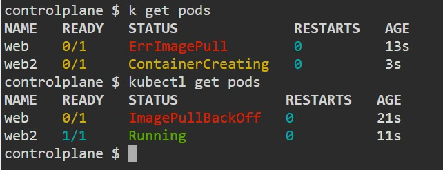
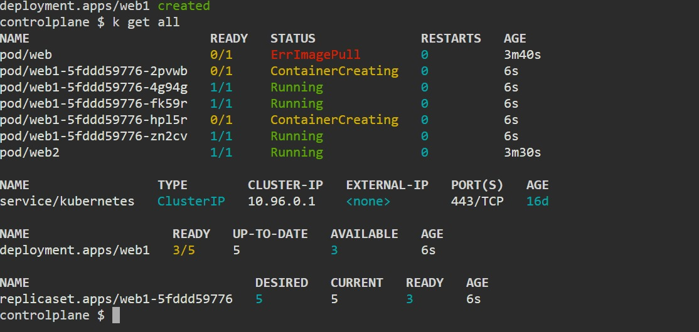

# 🟩🟦🟧🟨🟥 kubecolor: A Colorful Kubernetes Experience 🌟

**kubecolor** 🎨 turns your dull `kubectl` output into a vibrant rainbow 🌈! Say goodbye to boring text and hello to a colorful Kubernetes world 🌍! It makes reading logs and resources a breeze 🧹. 

## Installation 🚀

Wanna get started? Just run the installation script 🖥️. It's super easy! Find it [here](kubecolor.sh) and start the colorful adventure! 🌟

## Features ✨

- **Colorized Output**: kubecolor adds 🎨 color to your `kubectl` output for a much better view 👀.
- **Customizable Color Schemes**: Pick your favorite color combo 🎨💥, because who doesn't love customization? 😎
- **Easy Setup**: Just run a script and voila, you're ready to go 🚀!

